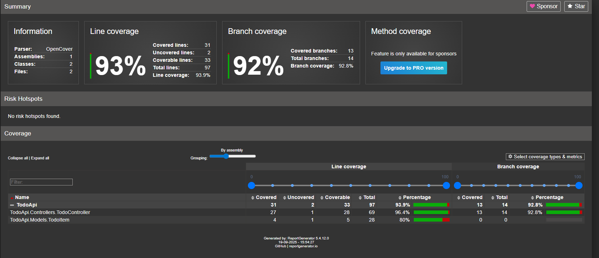

# Soft2-SoftwareQuality-OLA3

## Group

- Oskar (Ossi-1337, cph-oo221)
- Peter (Peter537, cph-pa153)
- Yusuf (StylizedAce, cph-ya56)

## Task Service (TodoApi)

Vores task service er en C# API som ligger i mappen [TodoApi](./TodoApi/) hvor man kan køre [TodoApi/Program.cs](./TodoApi/Program.cs).

## Unit tests og Code Coverage

Vi bruger xUnit som test framwork, og denne dotnet kommando med [testoptions.rsp](testoptions.rsp) for at køre test og code coverage:

```bash
dotnet test .\TodoApi\TodoApi.sln -c Release "@testoptions.rsp"
```

Vi har unit testet vores TodoController i [TodoApi.Tests/Controllers/TodoControllerTests.cs](./TodoApi.Tests/Controllers/TodoControllerTests.cs) - vi starter ikke ASP.NET Core host, rammer ingen HTTP endpoints og bruger ikke den rigtige InMemoryTodoRepository implementering, derfor er det unit test og ikke integrationstest.

Som sagt, så bruger vi Moq til at mocke vores InMemoryTodoRepository klasse

For at få skabt vores Code Coverage rapport, der bruger vi reportgenerator med denne kommando:

```bash
reportgenerator "-reports:.\TodoApi.Tests\TestResults\coverage.opencover.xml" "-targetdir:.\TodoApi.Tests\TestResults\CoverageReport" -reporttypes:Html
```

Et udsnit af vores Test results kan ses her:



Den fulde rapport kan findes i [documentation/TestResults/CoverageReport/index.html](./documentation/TestResults/CoverageReport/index.html)

## Static Code Analysis

Vi bruger StyleCop og [TodoApi/stylecop.json](./TodoApi/stylecop.json), med denne dotnet kommando for at se fejlene:

```bash
dotnet build .\TodoApi\TodoApi.sln --no-restore /p:RunAnalyzersDuringBuild=true > static-analysis-report.txt 2>&1
```

Vi lavede først nogle fejl i koden og lavede en static code analysis som kan ses i [documentation/static-analysis-report_errors.txt](./documentation/static-analysis-report_errors.txt)

Og så rettede vi dem og så lavede vi samme analysis hvor vi så havde ingen fejl i [documentation/static-analysis-report_no_errors.txt](./documentation/static-analysis-report_no_errors.txt)

## Code Quality deep-dive med SonarQube

Det har vi skrevet i [documentation/sonar-qube-report.md](./documentation/sonar-qube-report.md)

## Peer Code Review

Vores PR med feedback og ændringer kan findes i [https://github.com/Peter537/Soft2-SoftwareQuality-OLA3/pull/1](https://github.com/Peter537/Soft2-SoftwareQuality-OLA3/pull/1)

## Software Review

Vores siftware review kan findes i [software-review.md](software-review.md)

## Reflection on Testing and Code Quality

Vores refleksion omkring Testing og Code Quality kan findes i [reflection-on-testing-and-code-quality.md](reflection-on-testing-and-code-quality.md)
