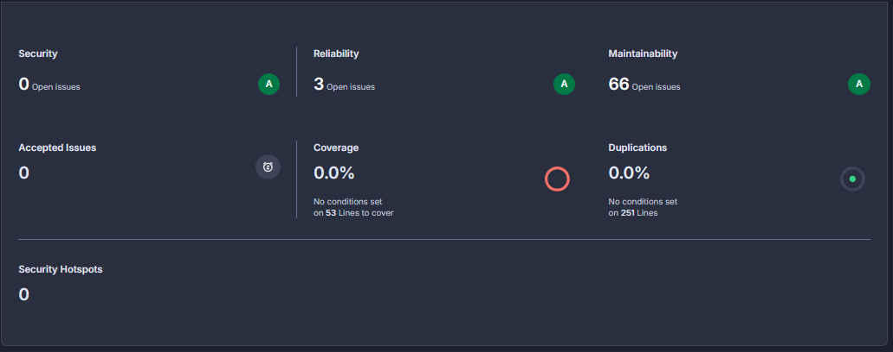
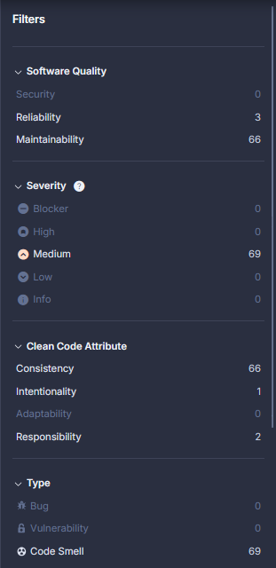

# SonarCloud-rapport – Peter537_Soft2-SoftwareQuality-OLA3

Dato: 2025-09-20  
Branch: main  
Organisation: Ossi (ossi-1337)  
Analyserede projekter:  
- TodoApi (produktionskode)  
- TodoApi.Tests (testkode)

## Resumé (Executive Summary)
- Security: 0 åbne issues (A)
- Reliability: 3 åbne issues (A)
- Maintainability: 66 åbne issues (A)
- Coverage: 0.0% på 53 “lines to cover” (se afsnit om dækning)
- Duplications: 0.0% på 251 linjer
- Security Hotspots: 0

Alle registrerede issues har severity “Medium” og ligger primært i kategorien Maintainability (Clean Code: Consistency).

## Kontekst og formål
Formålet med denne analyse er at få et objektivt billede af kodekvalitet og vedligeholdbarhed i TodoApi-projektet ved hjælp af SonarCloud. Rapporten samler hovedfund, forklarer centrale målepunkter og giver konkrete anbefalinger.

## Metode (Opsætning og kørsel)
- Værktøjer: SonarScanner for .NET (MSBuild), SonarCloud “Sonar way”-profil.
- Kildekode analyseret: C# i TodoApi (MAIN) og tests i TodoApi.Tests (TEST).
- Eksklusioner: Alt under `documentation/**` er ekskluderet fra selve kodeanalysen (for at udelukke genererede HTML/CSS/JS-artefakter fra testværktøjer).
- Dækningsrapport: OpenCover-rapport placeret i `documentation/TestResults/coverage.opencover.xml`. Bemærk: Eksklusionen påvirker ikke indlæsning af selve coverage-filen.

Kommandoer (eksempel):
```powershell
# 1) Start analyse
dotnet sonarscanner begin `
  /k:"Peter537_Soft2-SoftwareQuality-OLA3" `
  /o:"ossi-1337" `
  /d:sonar.host.url="https://sonarcloud.io" `
  /d:sonar.login="%SONAR_TOKEN%" `
  /d:sonar.exclusions="documentation/**" `
  /d:sonar.cs.opencover.reportsPaths="documentation/**/coverage.opencover.xml"

# 2) Byg løsning
dotnet build .\Soft2-SoftwareQuality-OLA3.sln -c Debug

# 3) Kør tests og generér coverage (OpenCover)
dotnet test .\TodoApi.Tests\TodoApi.Tests.csproj -c Debug `
  /p:CollectCoverage=true `
  /p:CoverletOutput=.\documentation\TestResults\coverage `
  /p:CoverletOutputFormat=opencover `
  /p:Include="[TodoApi]*" `
  /p:Exclude="[*.Tests]*;[xunit.*]*"

# 4) Afslut analyse
dotnet sonarscanner end /d:sonar.login="%SONAR_TOKEN%"
```

Alternativ konfiguration (fil):  
Tilføj i roten en `sonar-project.properties` for at fastholde eksklusioner:
```
sonar.exclusions=documentation/**
sonar.coverage.exclusions=documentation/**,**/*.html,**/*.js,**/*.css
sonar.cs.opencover.reportsPaths=documentation/**/coverage.opencover.xml
```

## Afgrænsninger og kendte forhold
- PDF-rapport: SonarCloud tilbyder PDF-rapporter kun for Enterprise-planen og op. Se [SonarSource-dokumentation](https://docs.sonarsource.com/sonarqube-cloud/getting-started-with-enterprise/viewing-enterprise-reports/project-pdf-reports/).
- Coverage vises som 0.0% i dashboardet, selvom OpenCover-filen bliver fundet. Det skyldes sandsynligvis, at dækningen i rapporten ikke mappes til produktionsfilerne i TodoApi (se “Fejlsøgning af coverage”).

## Resultater (skærmbilleder)
Følgende skærmbilleder stammer fra SonarCloud:




Tolkning:
- 3 Reliability-issues og 66 Maintainability-issues.  
- Alle 69 issues har severity “Medium”.  
- Ingen Security-issues eller Hotspots.


## Fejl af coverage (0.0%)

Vi havde et problem med at sonarqube ikke brugte vores 'coverage.opencover.xml', selvom man kan se under kørslen at den bliver fundet og læst, så fremgår det som om at coverage er 0%. Så ignorere denne del i rapporten (sceenshots).


## Konklusion
Koden scorer samlet A på Security, Reliability og Maintainability, men har en række konsistensrelaterede maintainability-issues, der er lette at udbedre. Dækning vises p.t. som 0% på grund af mismatch mellem coverage-rapport og produktionsfiler; når det er løst, kan Quality Gate udvides med krav til dækning.

Når de nævnte StyleCop/Sonar-regler er adresseret, forventes et klart fald i antallet af issues og en mere stabil codebase.

## Bilag
- PDF-rapporter er kun tilgængelige for Enterprise-planen på SonarCloud. Se [dokumentation](https://docs.sonarsource.com/sonarqube-cloud/getting-started-with-enterprise/viewing-enterprise-reports/project-pdf-reports/).